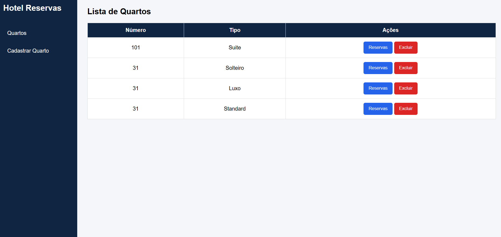
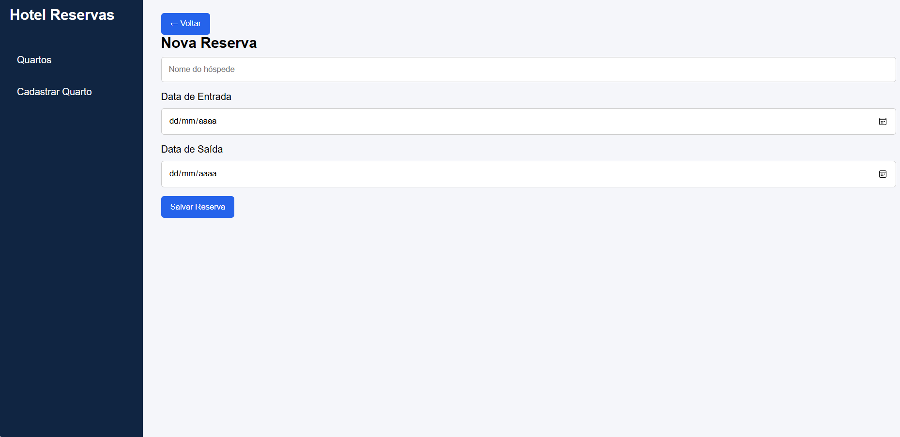
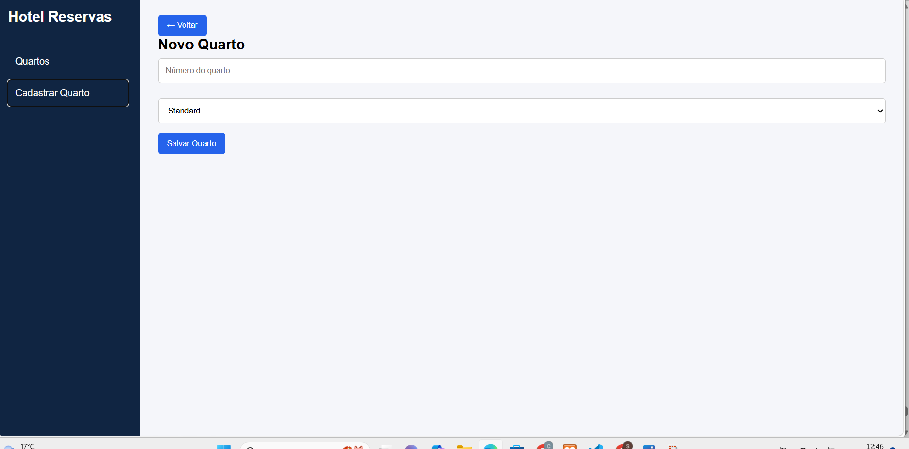

# Hotel Reservas

Sistema Web para gerenciamento de quartos e reservas de hotel.
Permite cadastrar quartos, visualizar reservas e gerenciar hospedagens de forma prática e organizada.

## Tecnologias

- HTML
- CSS
- JavaScript
- Node.js

| Funcionalidade | Tecnologia |
|:-|:-:|
| Estrutura da Interface | HTML |
| Estilização | CSS |
| Manipulação da Página | JavaScript |
| Requisições HTTP | Fetch API |
| Backend | Node.js + Express |
| Banco de Dados | MySQL |
| ORM | Prisma |
| Integração Front-End e Back-End | API REST |
| Navegação entre Telas | JavaScript |
| Exclusão de Registros | Método DELETE |

|  |  |  |
|:-:|:-:|:-:|
| Tela Inicial | Reserva | Quarto |

# Funcionalidades

- Cadastro de quartos
- Listagem de quartos
- Exclusão de quartos
- Cadastro de reservas
- Listagem de reservas por quarto
- Exclusão de reservas
- Navegação entre telas sem recarregar a página

# Estrutura do Projeto

```text
Frontend
├── index.html
├── style.css
└── script.js

Backend
├── server.js
├── src
│   ├── controllers
│   ├── routes
│   └── data
└── prisma
```

# Para testar

- 1 Clone o repositório

```bash
git clone URL_DO_REPOSITORIO
```

- 2 Abra o projeto no VS Code

- 3 Instale as dependências do backend

```bash
npm install
```

- 4 Execute o servidor

```bash
node server.js
```

ou

```bash
npm start
```

- 5 Verifique se a API está rodando em:

```text
http://localhost:3000
```

- 6 Abra o arquivo **index.html** no navegador

- 7 Cadastre quartos, visualize reservas e realize novas reservas

- O sistema iniciará na tela principal exibindo os quartos cadastrados e permitirá navegar pelas demais funcionalidades através do menu lateral.

# Autora

Clara Andrzejewsky Antonacci

Projeto desenvolvido para fins acadêmicos.
